<div align="center">

# 🍓 Pomona Nexus

### A AgRoField robotics workspace — drive the furrows, map the farm, disinfect the beds

*One ROS 2 Humble workspace for **Pomona**: an AgileX Scout V2 that maps, navigates,
and UV-C–treats crop beds — in Gazebo today, on the real robot tomorrow.*

[](https://docs.ros.org/en/humble/)
[](https://classic.gazebosim.org/)
[](https://navigation.ros.org/)
[](https://github.com/SteveMacenski/slam_toolbox)
[](LICENSE)

<br/>

<!-- Hero: online SLAM screencast → optimized GIF (source in src/pomona_slam/docs/). -->
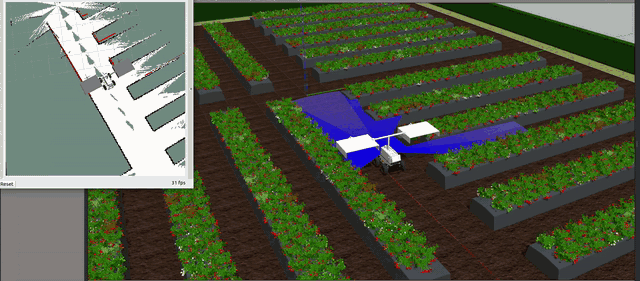

<sub>Live online mapping — <code>pomona_uvc</code> driving the strawberry farm while SLAM Toolbox grows the occupancy grid in RViz.</sub>

</div>

---

Pomona started life on a real **AgileX Scout V2** running ROS 1 Melodic; we ported the
geometry, meshes, and hardware config into a clean **ROS 2 Humble + Gazebo Classic 11**
workspace. The same tree runs the **simulation** on the dev machine and the **hardware
drivers** on the physical robot — toggle with `use_sim_time:=true|false`. Target use
case: **greenhouse fruit/bed work** (strawberry first; grape / apple / mushroom / maize /
tomato to follow).

```bash
cd /home/pravin/pomona_nexus
colcon build --symlink-install
source install/setup.bash
```

---

## 🤖 The Robot

<div align="center">

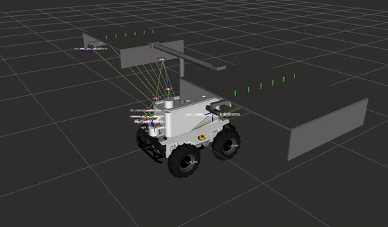

<sub>The <code>pomona_uvc</code> model in the description viewer — Scout V2 base, deck box, and the cantilever UV-C boom. · <code>ros2 launch pomona_description display_pomona_uvc.launch.py</code></sub>

</div>

Pomona is an **AgileX Scout V2** 4-wheel skid-steer base (0.925 × 0.380 × 0.210 m,
wheelbase 0.498 m) carrying a white **deck box** (`box_link`) that holds the sensors and
payload. Geometry, meshes, and the two robot models live in
**[`pomona_description`](src/pomona_description/README.md)**.

It ships in **two self-contained models** — pick the one for the job:

| Model | Payload | For |
|---|---|---|
| 🦾 **pomona_original** | UFactory **xArm6** + DH **AG95** gripper + RealSense **D435** on the wrist, on `gazebo_ros2_control` | fruit picking / manipulation, MoveIt, the real robot |
| 💡 **pomona_uvc** | cantilever **UV-C boom** — T-frame mast, two 1 m panels with **12 lamp tubes** that glow violet and shoot blue UV-C **ray-fans** at the beds, plus **2 down-looking RealSense D455** cameras | bed disinfection (sim) |

The **UV-C boom** (`uvc_cantilever.xacro`) is a vertical mast + cross-tube reaching two
downward panels at **±1.0 m** (one per bed). Each lamp tube renders a `gpu_ray` fan in
Gazebo (always-on; marks where the UV-C lands), while the toggleable disinfection **dose**
is owned by **[`pomona_uvc`](src/pomona_uvc/README.md)**.

```bash
ros2 launch pomona_description display_pomona_original.launch.py   # arm model, RViz
ros2 launch pomona_description display_pomona_uvc.launch.py        # UV-C boom, RViz
```

---

## 🌱 Environments

Pomona is built to run **many crop worlds**, each its own scene with its own plant assets.
Worlds and models live in **[`pomona_gazebo`](src/pomona_gazebo)**; the plant/prop assets
are authored in `cad_assets_studio/` and promoted to `models/<crop>/`.

### 🍓 1 · Strawberry — *ready* ✅

The flagship world: a **pinwheel strawberry farm** — mulch beds laid out in rows and
columns, a hedge boundary, and **~1 500 strawberry plants** on soil/grass ground, with
`pomona_uvc` spawned at the field origin on the 2 m cross-aisle.

<div align="center">

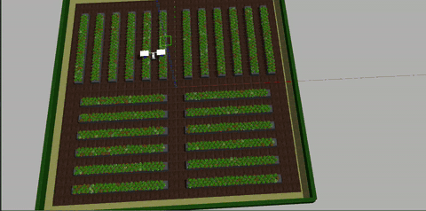

<sub>The pinwheel strawberry farm in Gazebo — mulch bed rows, hedge boundary, ~1 500 plants (1.5× speed). · <code>ros2 launch pomona_gazebo strawberry_farm.launch.py use_rviz:=true</code></sub>

</div>

#### 🌿 Plant variants

Six static, textured plant models (`models/strawberry/`) — four ripeness stages plus two
**diseases** that are the UV-C treatment targets:

<table>
<tr>
<td align="center">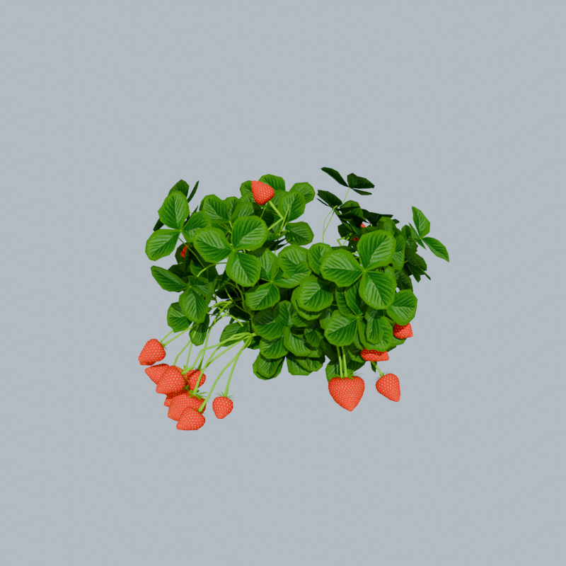<br/><sub><b><code>ripe</code></b> · red, pickable 🍓</sub></td>
<td align="center">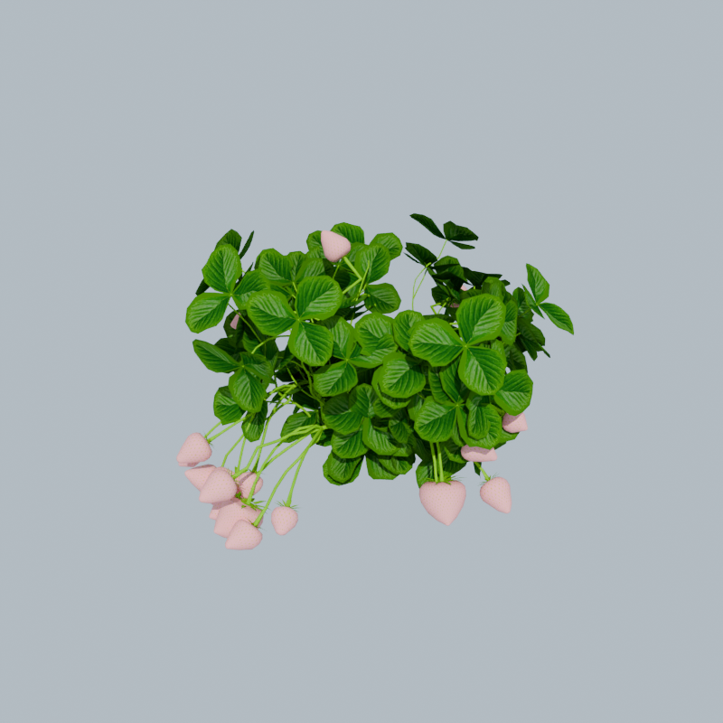<br/><sub><b><code>halfripe</code></b> · pink-white 🤍</sub></td>
<td align="center">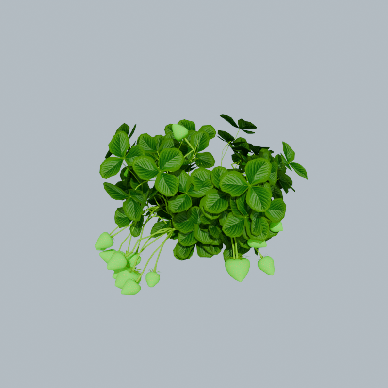<br/><sub><b><code>unripe</code></b> · green 🟢</sub></td>
</tr>
<tr>
<td align="center">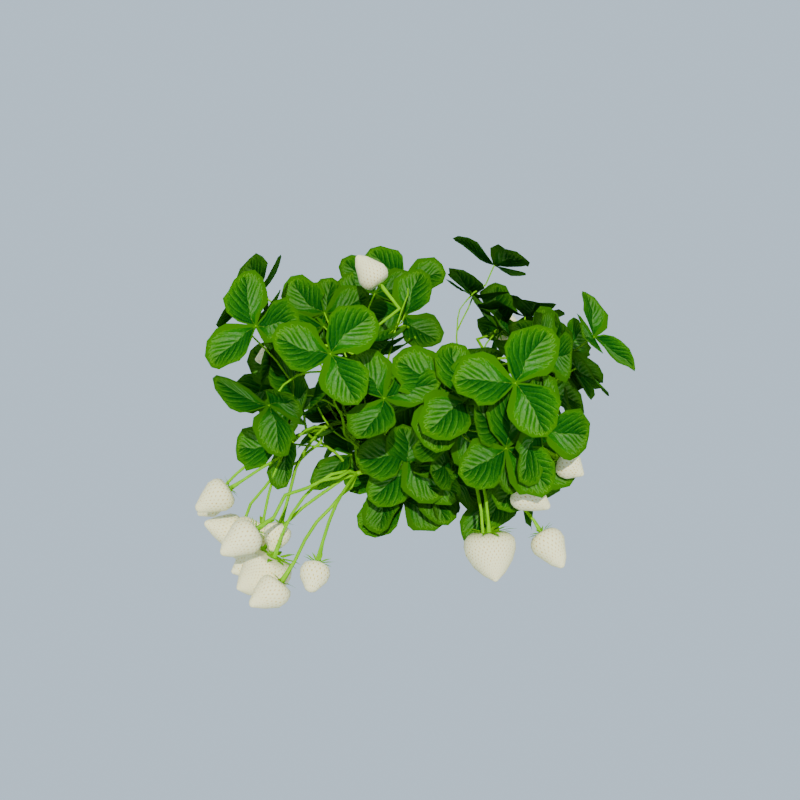<br/><sub><b><code>flower</code></b> · blossom 🌸</sub></td>
<td align="center">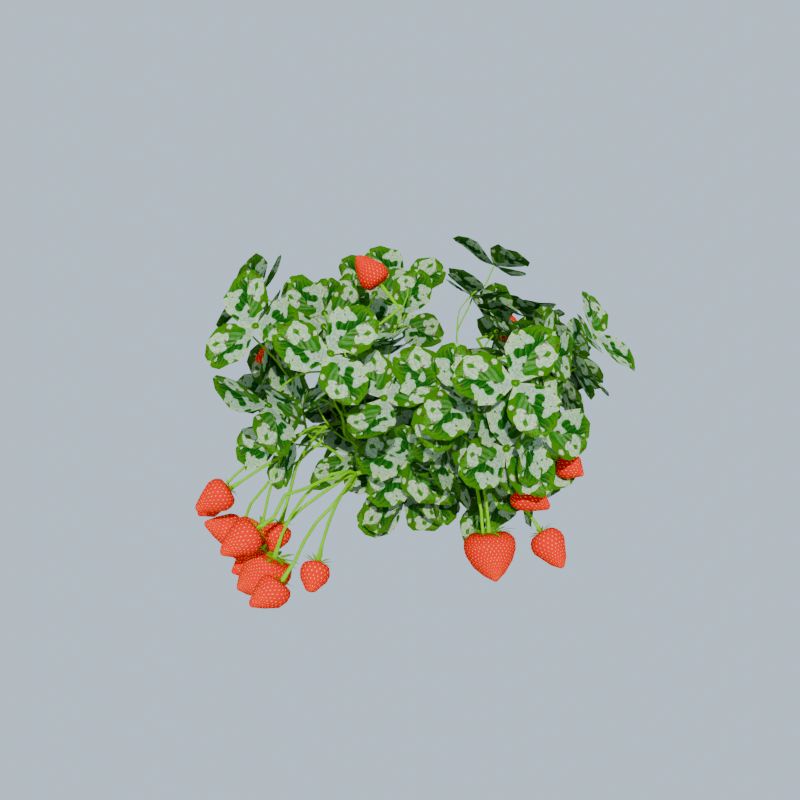<br/><sub><b><code>mildew</code></b> · powdery mildew 🦠 <i>UV-C target</i></sub></td>
<td align="center">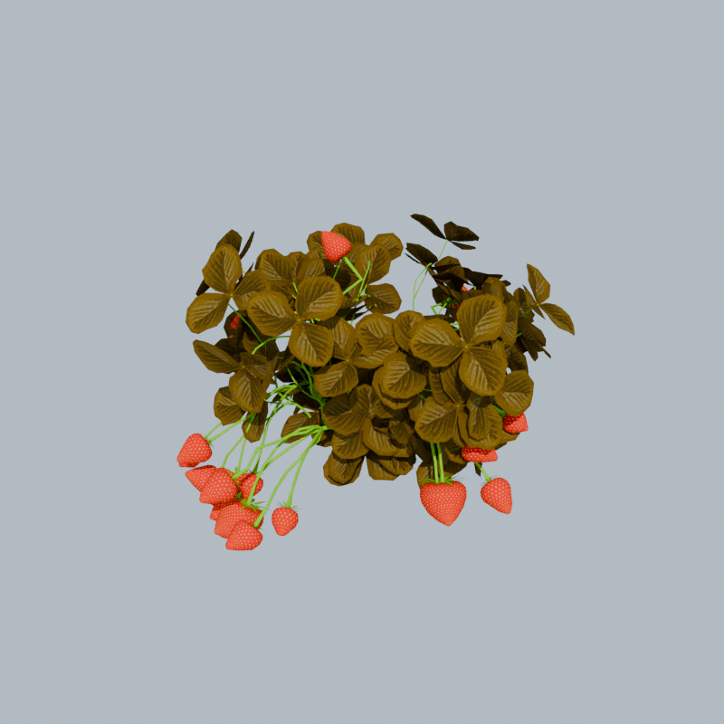<br/><sub><b><code>leafscorch</code></b> · leaf scorch 🍂 <i>UV-C target</i></sub></td>
</tr>
</table>

#### 🎨 Textures

Each plant is built from a shared PBR texture set (`cad_assets_studio/strawberry/textures/`)
— swap the berry map for the ripeness stage, swap the leaf map for the disease:

<table>
<tr>
<td align="center">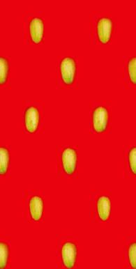<br/><sub>berry · ripe</sub></td>
<td align="center">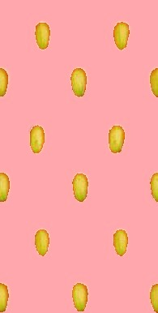<br/><sub>berry · halfripe</sub></td>
<td align="center">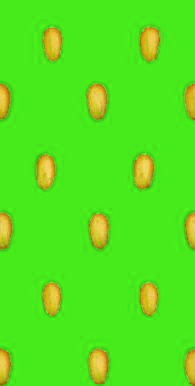<br/><sub>berry · unripe</sub></td>
<td align="center">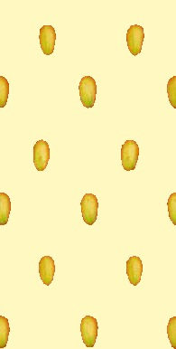<br/><sub>blossom</sub></td>
<td align="center"><br/><sub>leaf · healthy</sub></td>
<td align="center">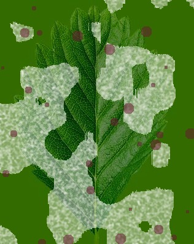<br/><sub>leaf · mildew</sub></td>
<td align="center">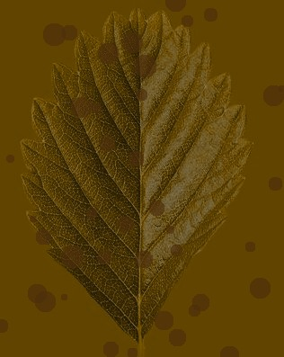<br/><sub>leaf · scorch</sub></td>
</tr>
</table>

<sub>+ shared normal/roughness maps (`berry_norm`, `leaf_norm`, `branch_norm`) and a leaf
alpha cut-out. Authored in `cad_assets_studio/strawberry/` (Blender) → promoted to Gazebo
models. See [`models/strawberry/README.md`](src/pomona_gazebo/models/strawberry/README.md).</sub>

#### 🛏️ Beds & field assets

The scene is assembled from crop-agnostic props in `models/environment/`:

| Asset | Role |
|---|---|
| `bed` | raised **mulch bed** — soil core wrapped in **plastic mulch** (`mulch_plastic.jpg`) |
| `mulch_hole` | planting hole punched through the mulch (plants sit in these) |
| `soil_ground` / `grass_ground` | textured ground planes under and around the beds |
| `hedge` | green boundary hedge around the whole farm |

Plants are seeded **row × column** along each bed; bed **pairs** sit at **±1.0 m** —
exactly the UV-C boom's panel spacing — so one pass centred on the furrow disinfects
**both beds at once**. The four quadrants pinwheel around the 2 m cross-aisle, and the
autonomous mission in [`pomona_navigation`](src/pomona_navigation/README.md) sweeps every
lane on SLAM.

### 🚧 2–6 · Tomato · Apple · Grape · Maize · Mushroom — *loading / future*

Scene folders and the naming convention are scaffolded; the plant assets aren't built yet.
Each will mirror the strawberry pattern (ripeness + disease variants, beds, a scene world):

| # | World | Crop | Status |
|---|---|---|---|
| 2 | `tomato_greenhouse` | 🍅 tomato | planned — assets TODO |
| 3 | `apple_orchard` | 🍎 apple | planned — assets TODO |
| 4 | `grape_vineyard` | 🍇 grape | planned — assets TODO |
| 5 | `maize_field` | 🌽 maize | planned — assets TODO |
| 6 | `mushroom_greenhouse` | 🍄 mushroom | planned — assets TODO |

New crops are produced with the **crop-asset-pipeline** from `cad_assets_studio/<crop>/`,
then promoted to `pomona_gazebo/models/<crop>/`.

### ⬛ `empty_world` — *the smoke-test* ✅

```bash
ros2 launch pomona_gazebo empty_world_pomona_original_xacro.launch.py   # base + arm
ros2 launch pomona_gazebo empty_world_pomona_uvc_xacro.launch.py        # base + UV-C boom
```

---

## 📦 Packages

| Package | What it does |
|---|---|
| **[`pomona_description`](src/pomona_description/README.md)** | URDF / xacro / meshes — the two robot models (shared sim + real) |
| **[`pomona_gazebo`](src/pomona_gazebo)** | Gazebo Classic 11 worlds, crop environments, launches (sim only) |
| **[`pomona_slam`](src/pomona_slam/README.md)** | SLAM Toolbox — online mapping, localization, offline replay |
| **[`pomona_navigation`](src/pomona_navigation/README.md)** | Nav2 stack + autonomous bed-disinfection mission |
| **[`pomona_uvc`](src/pomona_uvc/README.md)** | UV-C lamp on/off services + disinfection **dose map** ("blobs") for RViz |
| **[`pomona_moveit_config`](src/pomona_moveit_config)** | MoveIt 2 for the xArm6 + AG95 (stub) |
| **`pomona_bringup`** | CAN / USB / Ethernet vendor drivers (real robot only, stubs) |
| **`pomona_msgs`** | custom messages (empty day-1) |

```
pomona_nexus/
├── src/                  ← ROS 2 packages (colcon root)
├── cad_assets_studio/    ← 3D asset workshop (Blender/FreeCAD → Gazebo models)
├── goldmines/            ← archived ROS 1 source + robot config dumps (reference)
├── docs/                 ← hardware notes, runbooks (docs/sim_runbook.md)
└── README.md
```

---

## 🔧 Typical workflows

```bash
# Map a farm, then localize + navigate on it
ros2 launch pomona_gazebo strawberry_farm.launch.py
ros2 launch pomona_slam slam.launch.py use_sim_time:=true use_rviz:=true
ros2 launch pomona_slam save_map.launch.py map_name:=strawberry_farm
ros2 launch pomona_navigation bringup.launch.py localization:=amcl controller:=mppi

# Autonomous bed-disinfection mission + UV-C dose blobs in RViz
ros2 launch pomona_navigation autonomous_waypoint.launch.py controller:=mppi
ros2 launch pomona_uvc uvc_control.launch.py rviz:=true
ros2 service call /uvc/all std_srvs/srv/SetBool "{data: true}"
```

See [`docs/sim_runbook.md`](docs/sim_runbook.md) for the launch timeline, per-subsystem
verification, and fixes for known failures.

---

## 🦾 Hardware (real robot)

| Component        | Make / Model                  | Interface             |
|------------------|-------------------------------|-----------------------|
| Mobile base      | AgileX Scout V2 (4-wheel skid)| CAN bus `can0` @ 500k |
| Manipulator arm  | UFactory xArm6 (6-DOF)        | Ethernet `192.168.1.219` |
| End-effector     | DH Robotics AG95 gripper      | FTDI USB `/dev/DH_hand` 115200 8N1 |
| RGB-D camera     | Intel RealSense D435 (on EE)  | USB 3                 |
| 3D LiDAR         | Robosense (rslidar)           | Ethernet              |
| IMU              | Xsens MTi (DB4698SY)          | USB `/dev/xsens_imu`  |

```bash
ros2 launch pomona_bringup pomona_bringup.launch.py
```

---

<div align="center">
<sub>

**Author** Pravin Oli · `pravin.oli.08@gmail.com` · `olipravin18@gmail.com`<br/>
**License** [Apache-2.0](LICENSE) · **Attribution** [NOTICE.md](NOTICE.md) — AgileX, UFactory, DH Robotics, Intel RealSense, RoboSense, Xsens, and the ROS 2 / Gazebo / MoveIt / Nav2 communities<br/>
IFROS (Erasmus Mundus, UdG + ELTE) · EUROKNOWS CO., LTD.

</sub>
</div>
